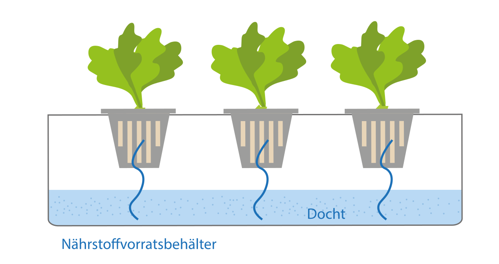

# Dochtbewässerung

Das Wasser befindet sich getrennt von der Pflanze in einem Reservoir. Beide sind durch einen sogenannten Docht verbunden. Der Docht saugt sich mit Wasser voll und gibt der Pflanze kontinuierlich eine begrenzte Menge an Wasser.

Das ganze mit einem Bild verdeutlicht:

[Quelle](https://www.hydroponik-urban-gardening.de/hydroponik-leitfaden/verschiedene-hydroponik-systeme/?L=0)

> Ist die Verwendung einer Dochtbewässerung plausibel? Könnten sich die Nutzer so etwas vorstellen? Sollten wir das in den Interviews erfragen? Möglicherweise noch andere Techniken?

## Nötige Ressourcen

- Docht und Dochthalter (z. B. [Amazon](https://www.amazon.de/Emsa-515351-Bew%C3%A4sserungsset-Kr%C3%A4utertopf-Dochthalter/dp/B00T1OG5ZU/))
- Wasser-Reservoir
- Eine Kombination aus beiden (z.B. [Amazon](https://www.amazon.de/MEPAL-Hydro-Kr%C3%A4utertopf-Plastik-Einheiten/dp/B00JQPOLDW/))
