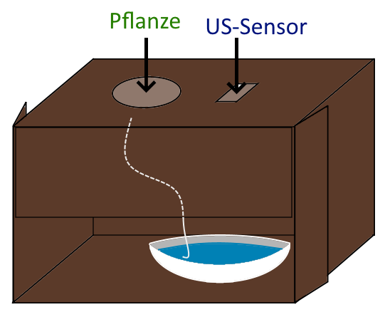

# Bewässerungskonzept

Es soll versucht werden die Dochtbewässerung und die Wasserstandsmessung mit Hilfe des Ultraschallsensors zu kombinieren. Damit das für alle im Team einfach zu realisieren ist, soll dafür lediglich ein Karton verwendet werden.

Das ganze ist in folgender Skizze nochmal verdeutlicht:

Mit dieser Methode kann das Wasser einfach aufgefüllt werden und der aktuelle Wasserstand kann vom Ultraschallsensor erfasst werden. 

Das gleiche Konzept kann in leicht abgewandelter Form auch ohne die Dochtbewässerungsmethode zur Wasserstandsmessung verwendet werden.

Für die Dochtbewässerung kann zum Beispiel [dieses Set](https://www.amazon.de/Emsa-515351-Bew%C3%A4sserungsset-Kr%C3%A4utertopf-Dochthalter/dp/B00T1OG5ZU/) verwendet werden.