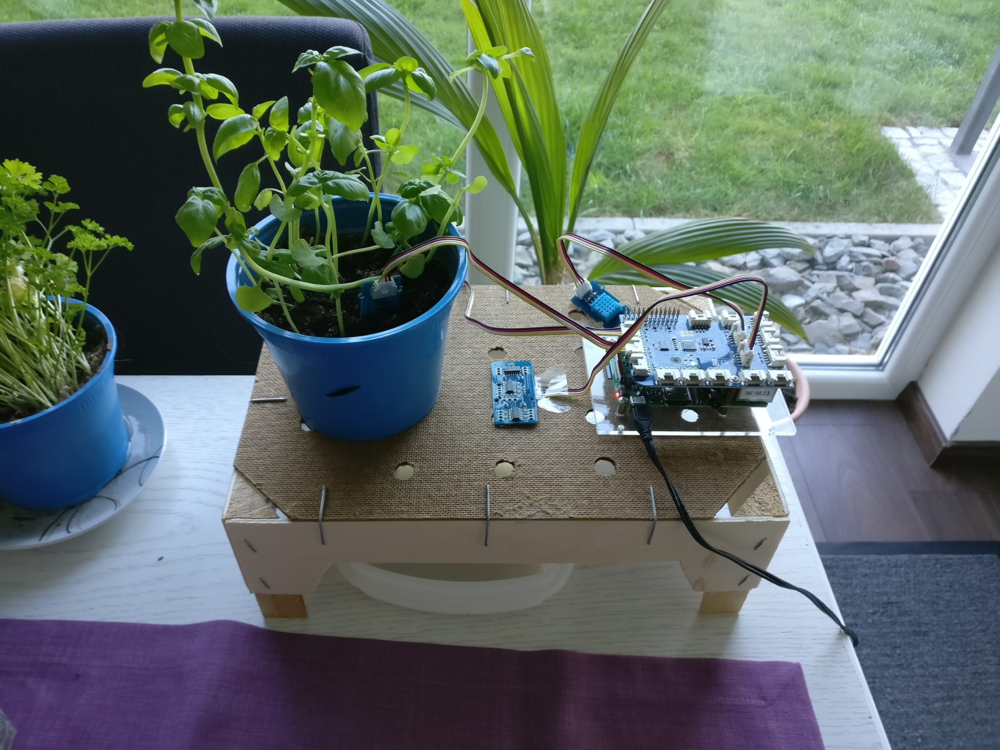
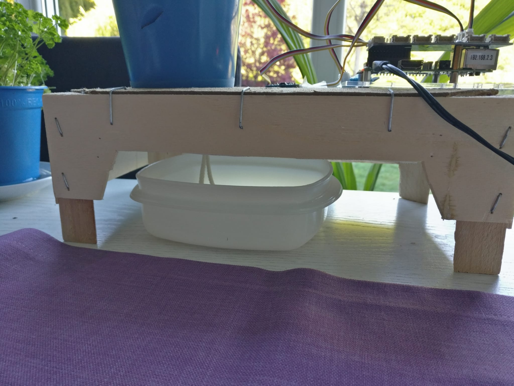
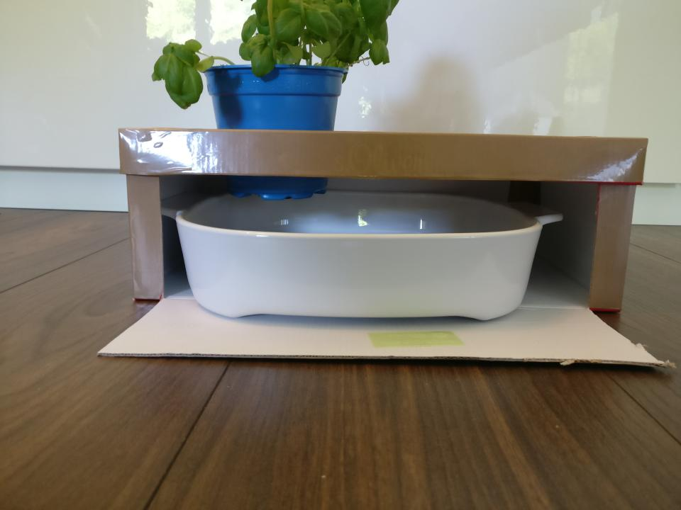
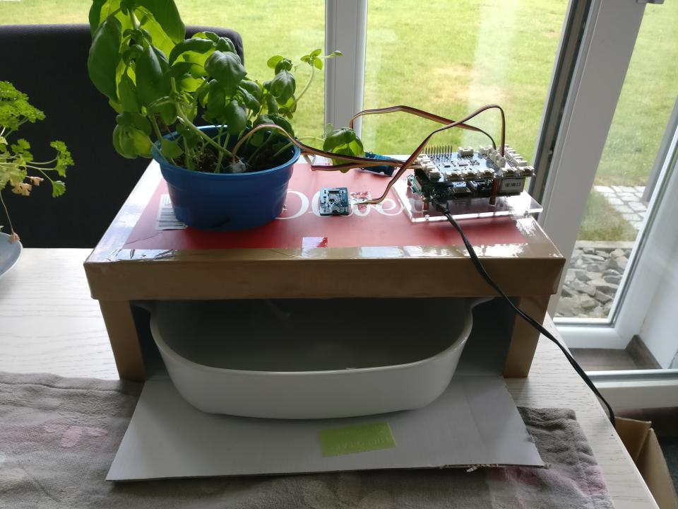
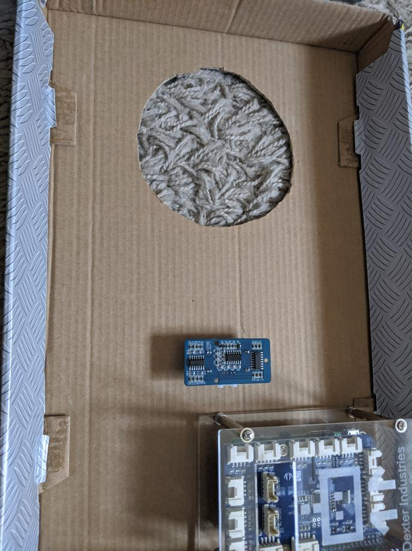
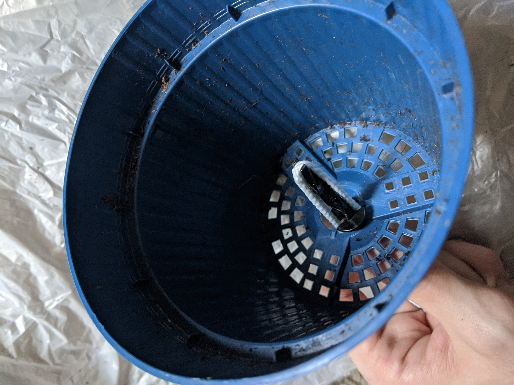
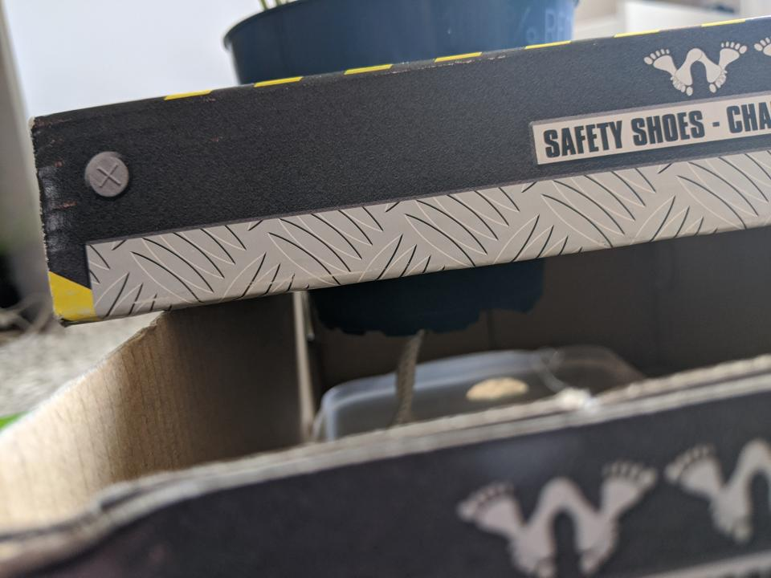
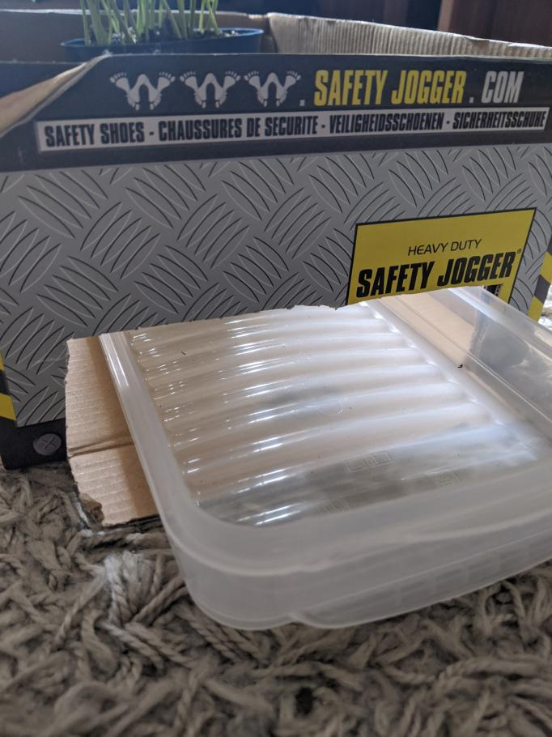
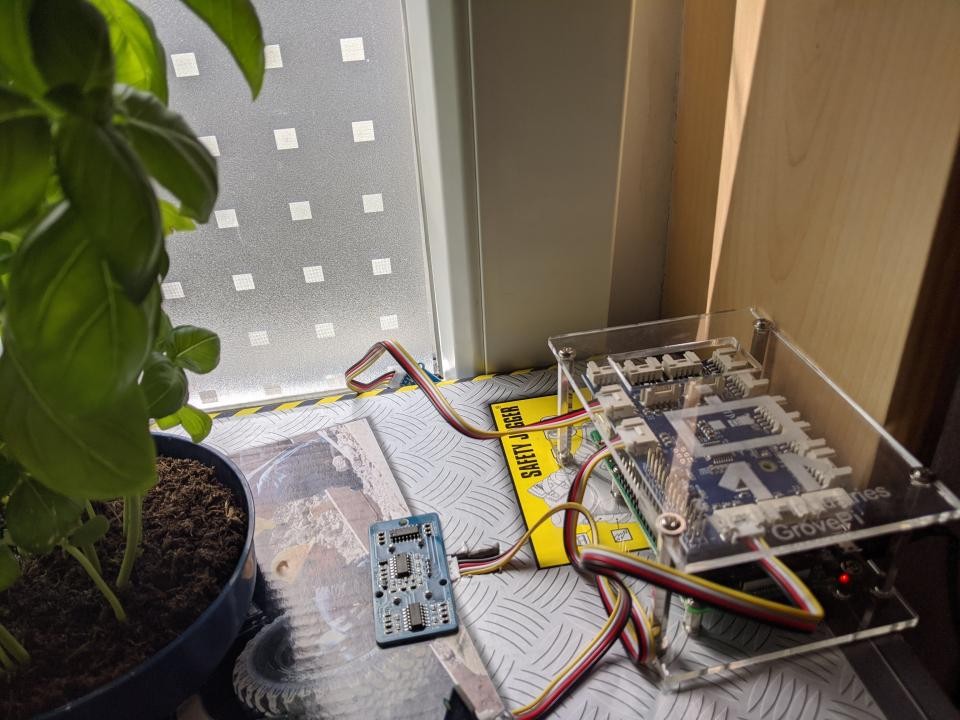

# Monitoring Bauhinweise

Für unsere Zwecke und den benötigten Platzbedarf reicht ein Schuhkarton ohne Probleme aus. Ein etwas höherer Karton wäre aber vielleicht noch besser geeignet. In der aktualisierten Version (siehe [Beispielbilder Johannes](#beispielbilder-johannes)) hat sich eine Mandarinenkiste als praktikabel erwiesen.

Zusätzlich wird ein Dochthalter sowie ein Docht benötig. In diesem [Set](https://www.amazon.de/Emsa-515351-Bew%C3%A4sserungsset-Kr%C3%A4utertopf-Dochthalter/dp/B00T1OG5ZU/) für 2,99€ sind 3 Dochthalter sowie 6 Döchte enthalten.

!!! hint "Der Karton muss hoch genug sein"
    Zwischen Wasseroberfläche und Ultraschallsensor sollten am Ende mindestens 5 cm Platz sein, da der Ultraschallsensor mit kleineren Distanzen Probleme hat.

## Maße

* Loch für den Kräutertopf: Ø 9,5 cm  
* Ultraschallsensor: 1,7 cm x 4 cm (1,5 cm x 3,5 cm passt, ist aber enger)
* Aussparung Kabel: 1,2 cm x 2 cm

!!! hint "Aussparung für die Bewässerung"
    Theoretisch sollten diese Aussparungen reichen, für einfacheres Nachfüllen des Wasserspeichers bietet es sich aber an, in eine Seite des Kartons ein Loch zu machen. Hierbei ist es sinnvoll nur einen Teil der Seite auszuschneiden, um die Stabilität des Kartons nicht zu verschlechtern.

## Beispielbilder Johannes

*Aktualisierte Box*

*Aktualisierte Box Frontansicht*

*Aussparungen mit Sensor*

*Seitliche Aussparung*

*Fertige Box Seitenansicht*

*Fertige Box Draufsicht*

## Beispielbilder Maurice

*Aussparung Kräutertopf*

*Aussparung Sensor*

*Dochthalter und Docht im Topf*

*Seitenansicht*

*Aussparung Seite*

*Fertige Box*
