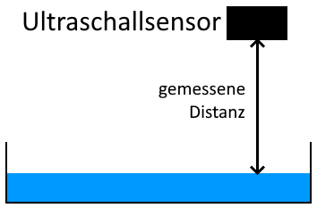
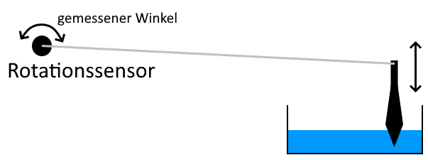

# Bestimmung des aktuellen Wasserstandes

Verschiedene Möglichkeiten:

- Abstandsmessung zur Wasseroberfläche (Ultraschallsensor)
- Gewichtsmessung
- Wasserstandssensor
- Schwimmer

## Abstandsmessung zur Wasseroberfläche

Mithilfe des [Ultraschallsensors](http://wiki.seeedstudio.com/Grove-Ultrasonic_Ranger/) kann der Abstand zur Wasseroberfläche gemessen werden. **Der Mindestabstand von Sensor zur Wasseroberfläche sollte hierbei 5cm nicht unterschreiten.** Eine Messung zur Kalibrierung der Distanz mit leerem Wasserstand ist notwendig um die Berechnung durchführen zu können.

Ein Konzept für diese Methode ist auf der Seite [Bewässerungskonzept](Konzept.md) zu finden.

## Gewichtsmessung

Verwendung eines [Gewichtssensors](https://www.seeedstudio.com/Load-Sensor-p-1344.html). Der verlinkte Sensor ist allerdings nicht spezifisch GrovePi Plus kompatibel.

Das Gewicht der Pflanze verändert sich mit der Zeit. Eine Basismessung am Anfang kann also mit der Zeit sehr ungenau werden, falls die Pflanze schwerer wird. 

## Wasserstandssensor

Verwendung eines [Wasserstandssensors](https://www.kiwi-electronics.nl/grove-water-level-sensor-10cm-for-arduino?lang=en) um den aktuellen Wasserstand zu erfassen. Diese Sensoren scheinen sehr Fehleranfällig zu sein und sind eventuell schwierig zu beschaffen.

## Schwimmer

Durch die Kombination des [Rotationssensors](http://wiki.seeedstudio.com/Grove-Rotary_Angle_Sensor/) mit einem Hebel und einem Schwimmer könnte auch versucht werden den Wasserstand anhand des gemessenen Winkels zu bestimmen. 

Hier gibt es allerdings einige zu beachtende Schwierigkeiten:

- Der Rotationssensor ist nicht sehr leichtgängig
- Ein Schwimmer muss leicht genug sein, um auf dem Wasser zu schwimmen, aber trotzdem schwer genug, um das Potentiometer durch sein Gewicht zu drehen. (Wenn der Hebel lang genug ist könnte das lösbar sein)

