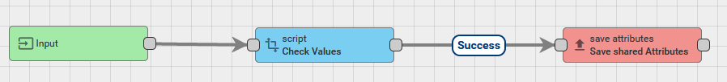

# Kritischer Status

Um  herauszufinden, ob der Kräuterstatus kritisch ist, wurden die ``Gemeinsamen Eigenschaften (shared keys)`` von
dem IoT-Thingsboard verwendet. Mithilfe dieser lassen sich Schlüssel-Werte Paare für die Kits festlegen.
In unserem Fall handelt es sich um die Schlüssel ``humCritical, lightCritical, moistureCritical, tempCritical, waterCritical``
welche jeweils für einen Sensor stehen und folgende Werte annehmen:
- true, falls der zuletzt gesendete Werte im kritischen Bereich ist
- false, falls der zuletzt gesendete Werte im guten Bereich ist.

Die Auswertung erfolgt dabei über eine einfache Regelkette. Welche wie folgt aussieht:

*Regelkette*

Die erste Aktion ``Input`` ist der Start der Regelkette, welche die gesendeten Daten beinhaltet. 
Die zweite Aktion ``Check Values`` ist vom Typ ``script`` und erlaubt es mithilfe einfachen JavaScript die eingehenden Werte zu verarbeiten.
In diesem Fall werden die eingehenden Werte überprüft und die jeweiligen gemeinsamen Eigenschaften gesetzt / verändert. 
Folgend ein kleiner Ausschnitt der Auswertung des Wasserstandes:
```javascript
var originalMessage = msg;

msgType = 'POST_ATTRIBUTES_REQUEST';
msg = {
    waterCritical: false,
    moistureCritical: false,
    lightCritical: false,
    tempCritical: false,
    humCritical: false
};

if ('water' in msg && msg.water <= 1) {
    msg.waterCritical = true;
}
```
Zuerst werden die Eigenschaften alle auf False gesetzt um mögliche Fehler zu verhindern.
Schließlich folgt die eigentliche Überprüfung. In diesem Fall wird nur überprüft ob das Wasser niedriger als einen Zentimeter ist.
Falls dem so sei wird der ``waterCritical``-Wert auf ``true`` gesetzt.

Die Daten können schließlich mit folgendem HTTP-GET abgefragt werden:
``'https://iot.jaykju.de/api/v1/TOKEN/attributes'`` (Siehe: [device-api-controller:getDeviceAttributes](https://iot.jaykju.de/swagger-ui.html#!/device-api-controller/getDeviceAttributesUsingGET)).

Dabei wird beispielsweise folgendes JSON zurückgeben:
```json
{
  "shared": {
    "tempCritical": false,
    "moistureCritical": false,
    "waterCritical": true,
    "humCritical": false,
    "lightCritical": true
  }
}
```

