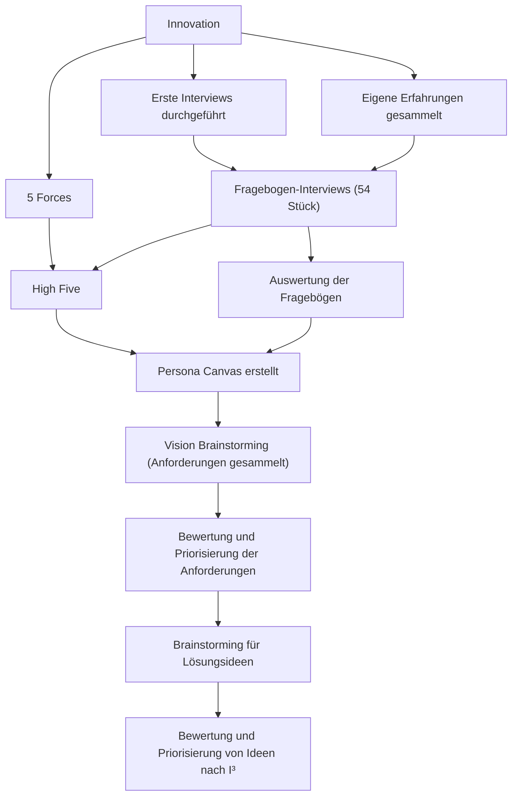
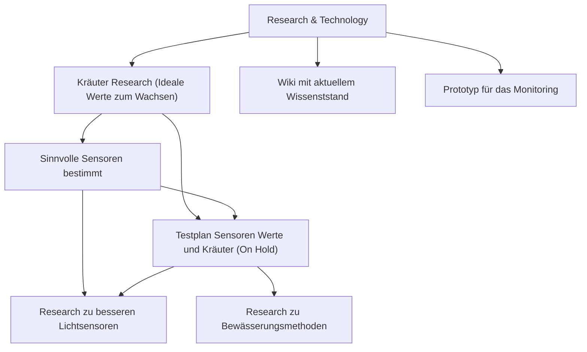

    

---

# GPA: Digital Kitchen Herbs - Nachschlagewerk

## Allgemeines

An dieser Stelle soll eine Art Nachschlagewerk für das GPA Digital Kitchen Herbs entstehen.
Durch eine sinnvolle Aufbereitung soll es möglich sein, Quellen und eigene Dokumente schnell nachzuschlagen.

Für die Literatur werden Beispielsweise folgende Informatioen (wenn möglich) festgehalten:

- Zusammenfassung
- Wichtigste Informationen
- Weitere Links
- Schlagworte

Dokumente und Informationen können über die Suche oder über die Tags-Seite gefunden werden.

## Historie

### Innovation

### Research & Technology

